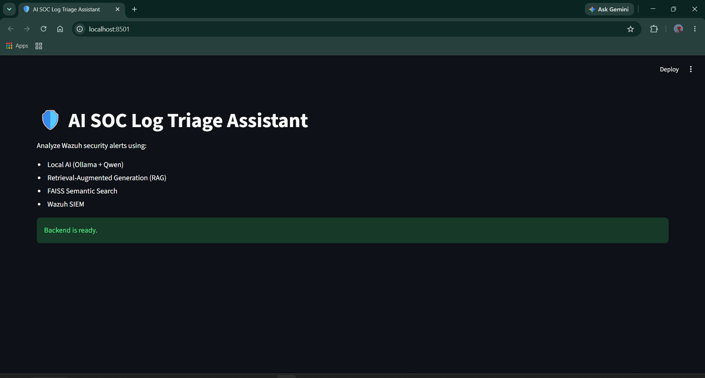
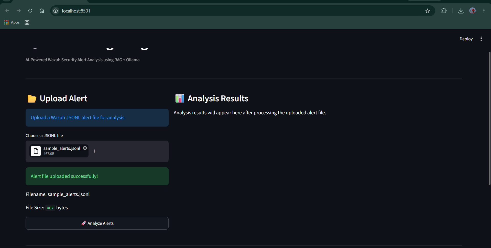
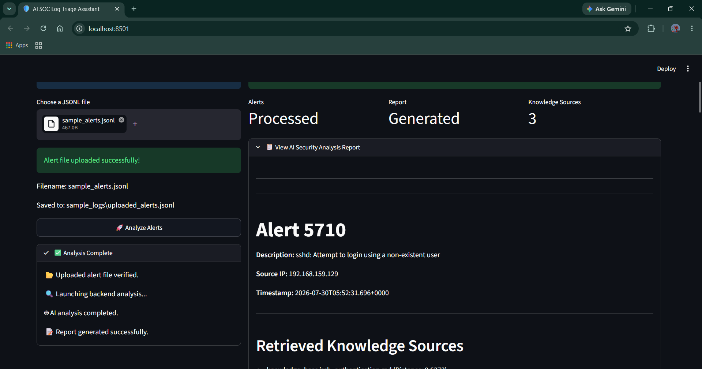
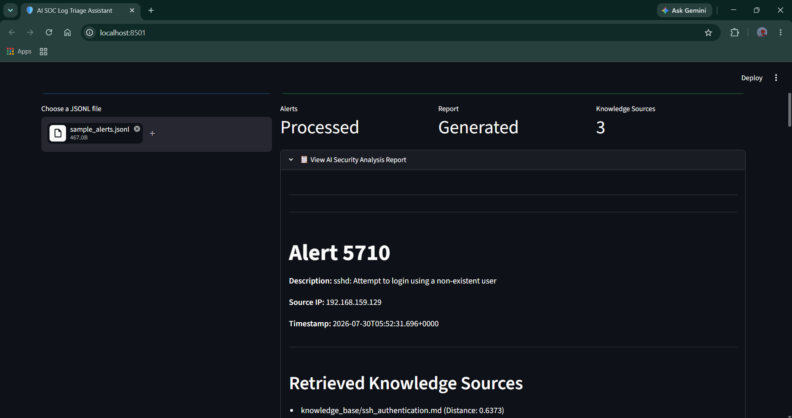
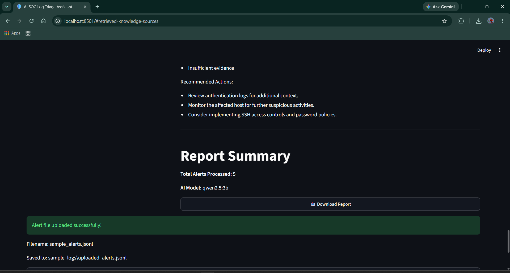

<div align="center">

# 🛡️ AI SOC Log Triage Assistant

### Local, Privacy-Preserving AI Investigation Reports for Wazuh Security Alerts

*Retrieval-Augmented Generation over Wazuh alert exports, powered entirely by a local LLM — no cloud API, no data leaving the machine.*


</div>

---

## 📖 Overview

**AI SOC Log Triage Assistant** takes exported Wazuh security alerts and turns them into structured, analyst-style investigation reports using a **local, offline AI pipeline**.

Rather than sending raw security data to a third-party API, the entire pipeline — embedding generation, semantic retrieval, and language model inference — runs locally via **Ollama**. A small cybersecurity knowledge base (SSH authentication, MITRE ATT&CK, SOC investigation practices) is embedded and indexed with **FAISS**, so the LLM is grounded in retrieved reference material instead of guessing from parametric memory alone.

**What this project *is*:** an offline RAG pipeline that ingests exported Wazuh alert files (`.json` / `.jsonl`), retrieves relevant security knowledge, and generates a templated Markdown investigation report per alert, viewable and downloadable through a Streamlit dashboard.

**What this project is *not*:** a live-connected SIEM integration. There is no active connection to a Wazuh manager or API — alerts are consumed as static exports that follow Wazuh's alert JSON schema. This distinction matters and is called out explicitly so the scope isn't misread.

---

<h2>🖼️ Dashboard Preview</h2>

<p align="center">
  
  
</p>

<p align="center">
  
  
</p>

<p align="center">
  
</p>

## 🎯 Why This Project?

**The SOC problem.** Tier-1 SOC analysts triage a high volume of low-context alerts — most are noise (a mistyped password, a routine failed login), but each one still requires a first-pass judgment call: is this worth escalating?

**Traditional workflow.** An analyst manually cross-references the alert against internal runbooks, MITRE ATT&CK references, and prior incidents — repetitive work that scales linearly with alert volume.

**AI-assisted workflow.** This project automates the *first pass*: it retrieves the relevant reference material for a given alert and asks a local LLM to produce a structured summary, severity call, and next steps — using only the retrieved context and the alert itself, explicitly instructed to say "insufficient evidence" rather than fabricate a MITRE technique.

**Why RAG instead of prompting alone.** A general-purpose LLM has no knowledge of *this* team's investigation playbook. Retrieval-Augmented Generation grounds the model's output in an actual local knowledge base (`knowledge_base/`) at inference time, which is both more accurate and auditable — the report shows exactly which documents were retrieved and their similarity distance.

**Why local LLMs / why privacy matters.** Security alert data — internal IPs, usernames, attack patterns — is sensitive. Every model call in this project (embedding via `nomic-embed-text` and generation via `qwen2.5:3b`) runs through a local Ollama instance. Nothing is sent to an external API.

---

## ✅ Key Features


| Feature | Description |
|---|---|
| **🤖 AI Alert Analysis** | Parses Wazuh-format alert JSON/JSONL and generates a structured investigation report per alert via `qwen2.5:3b` |
| **📚 Retrieval-Augmented Generation** | Retrieves top-K relevant knowledge base documents before prompting the LLM, rather than relying on prompting alone |
| **🔍 FAISS Semantic Search** | `IndexFlatL2` similarity search over embeddings generated with `nomic-embed-text` |
| **🔬 Retrieval Transparency** | Every report lists which knowledge documents were retrieved and their exact L2 distance score — not a black box |
| **🖥️ Streamlit Dashboard** | Upload a `.jsonl` alert file, trigger analysis, view the rendered report, and download it — no CLI required |
| **📄 Markdown Report Generation** | Structured, templated report per alert: summary, severity, possible threat, MITRE technique (or "insufficient evidence"), recommended actions |
| **⚠️ Error Handling** | Empty file uploads, malformed JSON lines, missing input files, and Ollama-offline scenarios are caught and surfaced with readable messages (in `analyze_alert.py` and `ui/dashboard.py`) |
| **🧩 Modular Backend** | Retrieval, prompt construction, and report writing are split into independent modules (`retriever.py`, `prompt_builder.py`, `report_generator.py`) |
| **📦 Offline / Local-First** | No external API keys, no cloud inference — Ollama handles both embedding and generation locally |

---

## 🏗️ Architecture

```
                         ┌─────────────────────────────┐
                         │   Exported Wazuh Alert File  │
                         │      (.json / .jsonl)        │
                         └───────────────┬──────────────┘
                                         │
                                         ▼
                         ┌─────────────────────────────┐
                         │   Alert Parser & Field       │
                         │   Extraction (rule, srcip,   │
                         │   timestamp, description)    │
                         │      scripts/analyze_alert.py│
                         └───────────────┬──────────────┘
                                         │
                                         ▼
                         ┌─────────────────────────────┐
                         │  Query Embedding             │
                         │  (nomic-embed-text via Ollama)│
                         └───────────────┬──────────────┘
                                         │
                                         ▼
                         ┌─────────────────────────────┐
                         │  FAISS Vector Search          │
                         │  (IndexFlatL2, Top-K = 3)     │
                         │      app/retriever.py         │
                         └───────────────┬──────────────┘
                                         │
                                         ▼
                         ┌─────────────────────────────┐
                         │  Knowledge Base Retrieval     │
                         │  (SSH auth / MITRE / SOC docs)│
                         └───────────────┬──────────────┘
                                         │
                                         ▼
                         ┌─────────────────────────────┐
                         │  Prompt Construction          │
                         │      app/prompt_builder.py    │
                         └───────────────┬──────────────┘
                                         │
                                         ▼
                         ┌─────────────────────────────┐
                         │  Local LLM Inference           │
                         │  (qwen2.5:3b via Ollama)       │
                         └───────────────┬──────────────┘
                                         │
                                         ▼
                         ┌─────────────────────────────┐
                         │  Markdown Investigation Report │
                         │      app/report_generator.py   │
                         └───────────────┬──────────────┘
                                         │
                                         ▼
                         ┌─────────────────────────────┐
                         │   Streamlit Dashboard          │
                         │   (view + download)            │
                         │      ui/dashboard.py           │
                         └─────────────────────────────┘
```

---

## 🔄 RAG Workflow

```
Alert Description (from parsed alert)
        │
        ▼
Embed Query  (nomic-embed-text)
        │
        ▼
FAISS Vector Search  (Top-K = 3, IndexFlatL2)
        │
        ▼
Retrieve Matching Knowledge Base Documents + Distance Scores
        │
        ▼
Assemble Context  (concatenated source documents)
        │
        ▼
Build Prompt  (alert fields + retrieved context + strict output template)
        │
        ▼
LLM Inference  (qwen2.5:3b via Ollama)
        │
        ▼
Structured Investigation Report  (Summary / Severity / Threat / MITRE / Actions)
```

The prompt template (`app/prompt_builder.py`) explicitly instructs the model not to assume facts absent from the alert, and to respond with **"Insufficient evidence"** rather than fabricate a MITRE ATT&CK technique — this is visible directly in the sample report below.

---

## 🖥️ Streamlit Dashboard Workflow

1. User uploads a `.jsonl` Wazuh alert export through the file uploader.
2. The file is validated (rejects empty uploads) and saved to `sample_logs/uploaded_alerts.jsonl`.
3. Clicking **Analyze Alerts** triggers `scripts/analyze_alert.py` as a subprocess, with live status updates (upload verified → backend launched → AI analysis → report generated).
4. On success, the generated Markdown report (`reports/ai_soc_report.md`) is rendered inline in an expandable panel.
5. A **Download Report** button exports the Markdown file directly.
6. On failure, the dashboard surfaces the captured stderr, with a specific hint if the failure is Ollama-related (service not running).

---

## 📂 Project Structure

```
ai-soc-log-triage-assistant/
│
├── app/
│   ├── retriever.py          # FAISS + Ollama embedding-based retrieval
│   ├── prompt_builder.py     # Structured prompt template construction
│   └── report_generator.py   # Markdown report writer
│
├── ui/
│   └── dashboard.py          # Streamlit frontend
│
├── scripts/
│   ├── analyze_alert.py      # Main CLI pipeline entry point
│   ├── generate_embeddings.py# Builds embeddings.json from knowledge_base/
│   ├── build_faiss_index.py  # Builds faiss_index.bin from embeddings.json
│   ├── search_faiss.py       # Standalone retrieval smoke test
│   ├── test_retriever.py     # Manual retrieval validation script
│   ├── test_ollama.py        # Manual Ollama connectivity check
│   └── process_alert.py      # Standalone single-alert field extractor
│
├── knowledge_base/
│   ├── ssh_authentication.md
│   ├── mitre_attack.md
│   └── soc_investigation.md
│
├── vector_store/             # Generated locally — not committed (see .gitignore)
│   ├── embeddings.json
│   └── faiss_index.bin
│
├── sample_logs/
│   ├── wazuh_alert.json
│   ├── ssh_failed_alerts.json
│   ├── sample_alerts.jsonl
│   └── uploaded_alerts.jsonl
│
├── reports/
│   └── ai_soc_report.md      # Example generated output
│
├── docs/
│   └── Day00.md – Day15.md   # Daily engineering log
│
├── screenshots/
│   └── day00/ – day15/
│
├── config.py                 # Model names, file paths, RAG parameters
├── requirements.txt
└── README.md
```

> **Note:** `vector_store/` is intentionally excluded from version control (see `.gitignore`) since it contains generated binary artifacts. It must be built locally via the two scripts below before running analysis — see Installation.

---

## 🛠️ Technology Stack

| Category | Technology |
|---|---|
| Programming Language | Python 3.10+ |
| LLM Runtime | Ollama (local inference server) |
| Generation Model | Qwen 2.5 (3B) |
| Embedding Model | `nomic-embed-text` |
| Vector Database | FAISS (`IndexFlatL2`) |
| Frontend | Streamlit |
| Alert Source Format | Wazuh alert JSON / JSONL exports |
| Version Control | Git / GitHub |
| Documentation | Markdown, daily engineering logs (`docs/`) |
| Data Handling | Local file I/O only — no external network calls at inference time |

---

## ⚙️ Installation

```bash
# 1. Clone the repository
git clone https://github.com/ananthancyber/ai-soc-log-triage-assistant.git
cd ai-soc-log-triage-assistant

# 2. Create and activate a virtual environment
python -m venv .venv
source .venv/bin/activate        # Windows: .venv\Scripts\activate

# 3. Install dependencies
# NOTE: requirements.txt currently only pins supporting libraries.
# faiss-cpu, numpy, and streamlit are required by the code but not yet
# listed there — install them explicitly until requirements.txt is fixed:
pip install -r requirements.txt
pip install faiss-cpu numpy streamlit ollama

# 4. Install Ollama
# https://ollama.com/download

# 5. Pull the required local models
ollama pull qwen2.5:3b
ollama pull nomic-embed-text

# 6. Generate knowledge base embeddings
mkdir vector_store
python scripts/generate_embeddings.py

# 7. Build the FAISS index
python scripts/build_faiss_index.py

# 8. Run the dashboard
streamlit run ui/dashboard.py
```

> ⚠️ **Known limitation:** `requirements.txt` in its current committed state is UTF-16 encoded and missing `faiss-cpu`, `numpy`, and `streamlit`. Step 3 above works around this. Regenerating the file with `pip freeze > requirements.txt` inside a working virtual environment is a pending cleanup item (see *Known Limitations*).

---

## ▶️ Usage

**Dashboard (recommended):**
```bash
streamlit run ui/dashboard.py
```
Upload a `.jsonl` alert file (see `sample_logs/sample_alerts.jsonl` for the expected format) and click **Analyze Alerts**.

**Command line:**
```bash
python scripts/analyze_alert.py
```
Processes the file set in `config.INPUT_FILE` (defaults to `sample_logs/ssh_failed_alerts.json`) and writes the report to `reports/ai_soc_report.md`.

**Retrieval-only check (no LLM call):**
```bash
python scripts/test_retriever.py
```

---

## 📸 Screenshots

<p align="center">
  
  
</p>

<p align="center">
  
  
</p>

<p align="center">
  
</p.

- **Dashboard home** — runtime metrics (model, embedding model, Top-K)
- **File upload** — JSONL alert upload flow
- **Processing status** — live status indicators during analysis
- **Generated report** — rendered Markdown investigation report
- **Error handling** — Ollama-offline and empty-file states

---

## 📄 Sample AI Report

Excerpt from an actual run (`reports/ai_soc_report.md`), analyzing a Wazuh `sshd` alert:

```markdown
# Alert 5710

**Description:** sshd: Attempt to login using a non-existent user
**Source IP:** 192.168.159.129
**Timestamp:** 2026-07-30T05:52:31.696+0000

## Retrieved Knowledge Sources
- knowledge_base/ssh_authentication.md (Distance: 0.6373)
- knowledge_base/mitre_attack.md (Distance: 0.9684)
- knowledge_base/soc_investigation.md (Distance: 1.0652)

## AI Analysis

Alert Summary:
- The alert indicates a failed SSH login attempt using a non-existent
  user, which is a common failure scenario but requires investigation
  as it could indicate malicious activity.

Severity:
- Medium

Possible Threat:
- Insufficient evidence

MITRE ATT&CK:
- Insufficient evidence

Recommended Actions:
- Review the authentication logs for similar events.
- Check if any account was disabled or invalidated after this attempt.
- Monitor traffic from 192.168.159.129 for a broader pattern.
```

Note the model correctly returns **"Insufficient evidence"** for the MITRE technique on a single isolated event — the prompt template's evidence constraint is working as designed, not just decorative.

---

## 🧪 Validation & Error Handling

There is currently **no automated test suite** (no `pytest`, no CI pipeline, no assertions). What exists is manual validation and inline defensive handling:

| Scenario | How it's handled | Where |
|---|---|---|
| Malformed JSON line in alert file | Skipped with a warning, processing continues | `scripts/analyze_alert.py` |
| Missing input file | Caught, error printed, clean exit | `scripts/analyze_alert.py` |
| Empty uploaded file | Rejected before processing starts | `ui/dashboard.py` |
| Ollama service unavailable | Subprocess failure caught, stderr inspected for "ollama", specific warning shown | `ui/dashboard.py` |
| Per-alert processing failure | Caught individually so one bad alert doesn't halt the whole batch | `scripts/analyze_alert.py` |
| Retrieval sanity check | Manual script queries known phrases against the index and prints ranked matches | `scripts/test_retriever.py` |
| Ollama connectivity check | Manual script sends a single chat request and prints the response | `scripts/test_ollama.py` |

Adding an actual `pytest` suite with assertions is listed under Future Improvements rather than claimed here.

---

## 🧠 Skills Demonstrated

- Retrieval-Augmented Generation (RAG) pipeline design
- Vector embeddings and semantic similarity search (FAISS)
- Local LLM deployment and inference via Ollama
- Prompt engineering with explicit evidence constraints and output templating
- Wazuh alert schema parsing (rule ID, MITRE mapping, severity, source IP)
- Modular Python architecture (separation of retrieval, prompting, and report generation)
- Streamlit frontend development with subprocess-based backend orchestration
- Defensive error handling for malformed input and unavailable services
- Structured technical documentation (16-day engineering log)

---

## 🧩 Challenges Solved

Grounded in actual commit history and code, not invented:

- **Modular refactor** — the project was restructured from a single script into `app/retriever.py`, `app/prompt_builder.py`, and `app/report_generator.py` (see commit `752ec86: refactor: modularize AI SOC Log Triage Assistant architecture`).
- **RAG integration** — moved from prompt-only analysis to embedding-based retrieval grounding (`5a631e3: feat(rag): integrate FAISS semantic retrieval into AI pipeline`).
- **Retrieval transparency** — reports were extended to show which documents were retrieved and their similarity distance, rather than hiding retrieval as a black box (`eb260a5: feat(rag): improve retrieval transparency and context quality`).
- **Frontend–backend integration** — the Streamlit UI invokes the existing CLI pipeline as a subprocess and parses its exit code/stderr, rather than duplicating pipeline logic in the UI layer.
- **Multi-alert JSONL parsing** — the parser tolerates malformed individual lines and per-alert exceptions without aborting the full batch.
- **Evidence-constrained prompting** — the prompt template explicitly forces "Insufficient evidence" responses instead of letting the model speculate a MITRE technique from a single ambiguous alert.

---

## 🚀 Future Improvements

Only items genuinely not yet implemented:


- Add an actual automated test suite (`pytest`) with assertions
- Live Wazuh Manager API integration (currently offline file-based only)
- Expand the knowledge base beyond three documents
- Hybrid retrieval (keyword + semantic) for better recall on short alert descriptions
- Docker / Docker Compose packaging
- PDF/HTML report export in addition to Markdown
- Batch analysis progress bar in the dashboard for large JSONL files

---

## 📅 Development Journey

This repository documents the full build process across `docs/Day00.md` through `docs/Day15.md` — each entry covering that day's objective, implementation, challenges hit, concepts learned, and screenshots. The project progressed from environment setup and a single Ollama call, through rule-based knowledge lookup, FAISS-backed RAG, modular refactoring, retrieval transparency, and finally a Streamlit dashboard with production-style error handling.

As of Day 15, remaining work before a v1.0 tag is final testing, a repository review pass, documentation polish, and the architecture diagram — this README is part of that closing pass.


---

## 📜 License

This project is licensed under the MIT License. See the [LICENSE](LICENSE) file for details.

---

## 👤 Author

**Ananthan D (Appu)**
B.Tech Information Technology · Aspiring SOC Analyst / Blue Team
GitHub: [@ananthancyber](https://github.com/ananthancyber)

This project is part of a broader self-directed cybersecurity portfolio built through daily, documented engineering work rather than coursework alone.