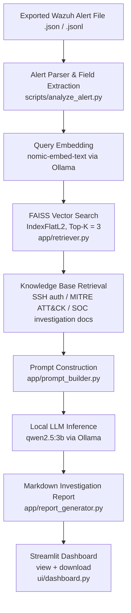
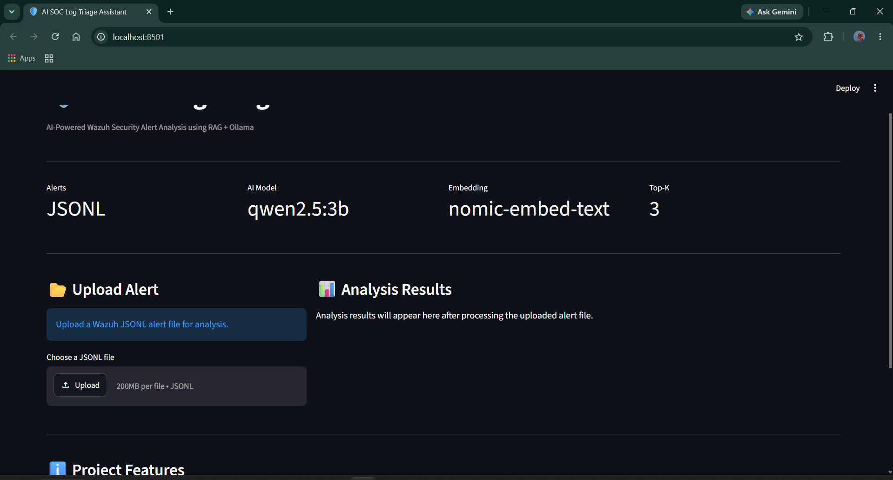
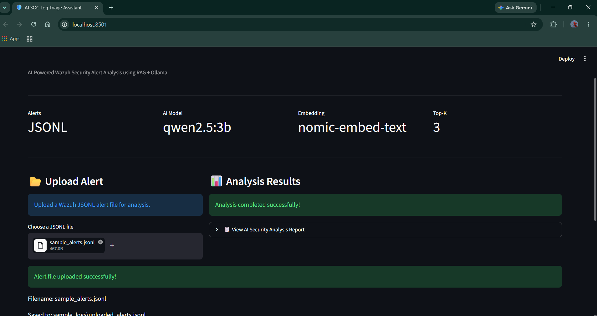
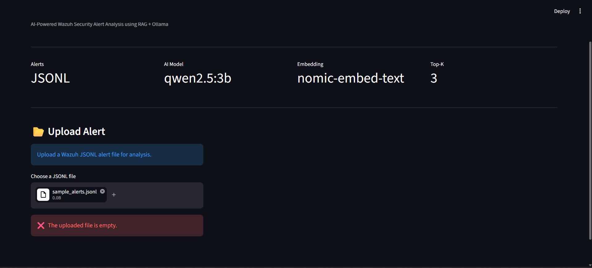

<div align="center">

# 🛡️ AI SOC Log Triage Assistant

### A Local, Privacy-Preserving RAG Pipeline That Turns Raw Wazuh Alerts Into Analyst-Style Investigation Reports

*No cloud API. No data leaving the machine. Every alert is analyzed by a locally hosted LLM, grounded in a retrieved cybersecurity knowledge base — not fabricated from parametric memory.*


</div>

---

## 📖 Project Overview

Tier-1 SOC analysts spend most of their shift on triage: reading an alert, deciding whether it's noise or a real lead, and writing that judgment down — repeated hundreds of times a day. This project automates the *first pass* of that work.

**What it does.** Takes an exported Wazuh alert file (`.json` / `.jsonl`), retrieves the most relevant reference material from a local cybersecurity knowledge base using semantic search, and asks a local LLM to produce a structured Markdown investigation report — summary, severity, possible threat, MITRE ATT&CK mapping (or an explicit "insufficient evidence" call), and recommended actions.

**Why AI helps here.** A Tier-1 analyst's job is pattern recognition against a body of reference knowledge (auth log behavior, MITRE technique indicators, investigation checklists) — the exact kind of task Retrieval-Augmented Generation is suited for, *if* the model is constrained to only reason from retrieved evidence instead of guessing.

**Why local matters.** Security alert data — internal IPs, usernames, attack patterns — shouldn't leave the machine to get triaged. Every model call here (embedding via `nomic-embed-text`, generation via `qwen2.5:3b`) runs through a local **Ollama** instance. There is no external API key anywhere in this project.

**Scope, stated plainly:** this is an offline RAG pipeline over exported alert files, not a live-connected SIEM integration. There's no active connection to a Wazuh manager or API. That's a deliberate scope boundary, not a missing feature — it keeps the project's claims matched to what's actually built.

---

## 🎯 Why I Built This

I built this after finishing a Wazuh Blue Team detection lab and noticing the gap between "the SIEM fires an alert" and "an analyst understands what it means." Most portfolio projects in this space stop at rule-writing. I wanted to build the next link in the chain: taking a raw alert and producing something closer to what a human analyst would actually write in a ticket — while being honest about where the model doesn't know enough to make a call, rather than letting it hallucinate a MITRE technique to look more impressive.

It's also a deliberate second project on top of the Wazuh lab: the sample alerts it processes are real alerts generated from that lab, not synthetic data, so the two projects reinforce each other.

---

## ✅ Key Features

**RAG / AI**
| Feature | Description |
|---|---|
| 🤖 AI Alert Analysis | Parses Wazuh-format alert JSON/JSONL and generates a structured investigation report per alert via `qwen2.5:3b` |
| 📚 Retrieval-Augmented Generation | Retrieves top-K relevant knowledge base documents before prompting, rather than relying on the model's parametric knowledge alone |
| 🔍 FAISS Semantic Search | `IndexFlatL2` similarity search over embeddings generated with `nomic-embed-text` |
| 🔬 Retrieval Transparency | Every report lists which knowledge documents were retrieved and their exact L2 distance score — the retrieval step is visible, not a black box |
| 🧠 Evidence-Constrained Prompting | The prompt template explicitly instructs the model to output "Insufficient evidence" rather than assert a MITRE technique it can't support from the alert alone |

**SOC / Security**
| Feature | Description |
|---|---|
| 🛡️ Wazuh Alert Schema Parsing | Extracts rule ID, description, source IP, and timestamp from real Wazuh alert JSON structures |
| 📄 Structured Report Template | Standardized output: Alert Summary → Severity → Possible Threat → MITRE ATT&CK → Recommended Actions |
| 📚 SOC Knowledge Base | Three reference documents (SSH authentication, MITRE ATT&CK, SOC investigation practices) the model retrieves from at inference time |

**Application / Engineering**
| Feature | Description |
|---|---|
| 🖥️ Streamlit Dashboard | Upload a `.jsonl` alert file, trigger analysis, view the rendered report, and download it — no CLI required |
| ⚠️ Error Handling | Empty uploads, malformed JSON lines, missing input files, and Ollama-offline scenarios are caught and surfaced with readable messages |
| 🧩 Modular Backend | Retrieval, prompt construction, and report writing are split into independent modules (`retriever.py`, `prompt_builder.py`, `report_generator.py`) |
| ✅ Automated Test Suite | `pytest` unit tests covering source-IP extraction, prompt construction, and report generation (added Day 16) |
| 📦 Offline / Local-First | No external API keys, no cloud inference — Ollama handles both embedding and generation locally |

---

## 🏗️ Architecture



The prompt template explicitly instructs the model not to assume facts absent from the alert, and to respond with **"Insufficient evidence"** rather than fabricate a MITRE ATT&CK technique — visible directly in the sample report below.

---

## 📂 Folder Structure

```
ai-soc-log-triage-assistant/
│
├── app/
│   ├── retriever.py          # FAISS + Ollama embedding-based retrieval
│   ├── prompt_builder.py     # Structured prompt template construction
│   └── report_generator.py   # Markdown report writer
│
├── ui/
│   └── dashboard.py          # Streamlit frontend
│
├── scripts/
│   ├── analyze_alert.py      # Main CLI pipeline entry point
│   ├── generate_embeddings.py# Builds embeddings.json from knowledge_base/
│   ├── build_faiss_index.py  # Builds faiss_index.bin from embeddings.json
│   ├── search_faiss.py       # Standalone retrieval smoke test
│   ├── test_retriever.py     # Manual retrieval validation script
│   ├── test_ollama.py        # Manual Ollama connectivity check
│   └── process_alert.py      # Early standalone single-alert field extractor (pre-dates the app/ pipeline)
│
├── tests/                    # pytest unit tests (added Day 16)
│   ├── test_extract_source_ip.py
│   ├── test_prompt_builder.py
│   ├── test_report_generator.py
│   └── test_config.py
│
├── knowledge_base/
│   ├── ssh_authentication.md
│   ├── mitre_attack.md
│   └── soc_investigation.md
│
├── vector_store/             # Generated locally — not committed (see .gitignore)
│   ├── embeddings.json
│   └── faiss_index.bin
│
├── sample_logs/
│   ├── wazuh_alert.json
│   ├── ssh_failed_alerts.json
│   ├── sample_alerts.jsonl
│   └── uploaded_alerts.jsonl
│
├── reports/
│   └── ai_soc_report.md      # Example generated output
│
├── docs/
│   └── Day00.md – Day16.md   # Daily engineering log (17 entries)
│
├── screenshots/
│   └── day00/ – day15/       # 76 images across 16 day folders
│
├── config.py                 # Model names, file paths, RAG parameters
├── requirements.txt
└── README.md
```

> **Note:** `vector_store/` is intentionally excluded from version control since it contains generated binary artifacts. It must be built locally via `generate_embeddings.py` and `build_faiss_index.py` before running analysis — see Installation.

> **On `process_alert.py`:** this is an early Day-2 script that extracts fields from a single alert independently of the current `app/` pipeline. It's kept in the repo as part of the documented build history rather than presented as part of the active pipeline.

---

## 🛠️ Technologies Used

| Category | Technology |
|---|---|
| Programming Language | Python 3.10+ |
| LLM Runtime | Ollama (local inference server) |
| Generation Model | Qwen 2.5 (3B) |
| Embedding Model | `nomic-embed-text` |
| Vector Database | FAISS (`IndexFlatL2`) |
| Frontend | Streamlit |
| Testing | pytest |
| Alert Source Format | Wazuh alert JSON / JSONL exports |
| Version Control | Git / GitHub (28 commits across the build) |
| Documentation | Markdown, daily engineering log (`docs/`) |
| Data Handling | Local file I/O only — no external network calls at inference time |

**Planned, not yet implemented:** LangChain, hybrid (keyword + semantic) retrieval, live Wazuh Manager API integration.

---

## 🧠 Cybersecurity Skills Demonstrated

- SOC Tier-1 triage workflow automation
- Wazuh alert schema parsing (rule ID, description, source IP, timestamp)
- MITRE ATT&CK-aware prompt design, including a hard constraint against unsupported technique attribution
- SOC investigation methodology encoded as retrievable reference material (`knowledge_base/`)
- Threat severity classification against defined criteria (Low / Medium / High / Critical)
- Security-conscious architecture: local-only inference, no external data transmission

## 🤖 AI Skills Demonstrated

- Retrieval-Augmented Generation (RAG) pipeline design, from embedding generation through to generation-time context assembly
- Vector embeddings and semantic similarity search with FAISS
- Local LLM deployment and inference via Ollama (no hosted API)
- Prompt engineering with explicit evidence constraints and strict output templating
- Retrieval transparency — surfacing which documents were retrieved and their similarity distance, rather than treating retrieval as a black box

---

## 🔄 Workflow

1. An exported Wazuh alert file (`.json` / `.jsonl`) is provided as input.
2. `scripts/analyze_alert.py` parses each alert line, extracting rule ID, description, source IP, and timestamp.
3. The alert description is embedded (`nomic-embed-text`) and used to query the FAISS index (`app/retriever.py`), returning the top-3 nearest knowledge base documents with their distance scores.
4. `app/prompt_builder.py` assembles a prompt containing the retrieved knowledge, the alert fields, and a fixed output template with an explicit "insufficient evidence" instruction.
5. The prompt is sent to `qwen2.5:3b` via Ollama.
6. `app/report_generator.py` appends the alert, its retrieved sources, and the model's analysis to `reports/ai_soc_report.md`.
7. In the Streamlit dashboard, this whole sequence runs as a subprocess triggered by an upload, with live status updates and an in-browser report viewer.

---

## ⚙️ Installation

```bash
# 1. Clone the repository
git clone https://github.com/ananthancyber/ai-soc-log-triage-assistant.git
cd ai-soc-log-triage-assistant

# 2. Create and activate a virtual environment
python -m venv .venv
source .venv/bin/activate        # Windows: .venv\Scripts\activate

# 3. Install dependencies
pip install -r requirements.txt

# 4. Install Ollama
# https://ollama.com/download

# 5. Pull the required local models
ollama pull qwen2.5:3b
ollama pull nomic-embed-text

# 6. Generate knowledge base embeddings
mkdir vector_store
python scripts/generate_embeddings.py

# 7. Build the FAISS index
python scripts/build_faiss_index.py

# 8. Run the dashboard
streamlit run ui/dashboard.py
```

> 

---

## ▶️ Usage

**Dashboard (recommended):**
```bash
streamlit run ui/dashboard.py
```
Upload a `.jsonl` alert file (see `sample_logs/sample_alerts.jsonl` for the expected format) and click **Analyze Alerts**.

**Command line:**
```bash
python scripts/analyze_alert.py
```
Processes the file set in `config.INPUT_FILE` (defaults to `sample_logs/ssh_failed_alerts.json`) and writes the report to `reports/ai_soc_report.md`.

**Run the test suite:**
```bash
pytest
```

**Retrieval-only check (no LLM call):**
```bash
python scripts/test_retriever.py
```

---

## 📥 Example Input

A single line from `sample_logs/sample_alerts.jsonl` — the Wazuh alert JSON schema this project parses:

```json
{"timestamp":"2026-07-30T05:52:31.696+0000","rule":{"id":"5710","description":"sshd: Attempt to login using a non-existent user"},"data":{"srcip":"192.168.159.129"}}
```

## 📤 Example Output

Excerpt from an actual run (`reports/ai_soc_report.md`), analyzing that same alert:

```markdown
# Alert 5710

**Description:** sshd: Attempt to login using a non-existent user
**Source IP:** 192.168.159.129
**Timestamp:** 2026-07-30T05:52:31.696+0000

## Retrieved Knowledge Sources
- knowledge_base/ssh_authentication.md (Distance: 0.6373)
- knowledge_base/mitre_attack.md (Distance: 0.9684)
- knowledge_base/soc_investigation.md (Distance: 1.0652)

## AI Analysis

Alert Summary:
- The alert indicates a failed SSH login attempt using a non-existent
  user, which is a common failure scenario but requires investigation
  as it could indicate malicious activity.

Severity:
- Medium

Possible Threat:
- Insufficient evidence

MITRE ATT&CK:
- Insufficient evidence

Recommended Actions:
- Review the authentication logs for similar events.
- Check if any account was disabled or invalidated after this attempt.
- Monitor traffic from 192.168.159.129 for a broader pattern.
```

Note the model returns **"Insufficient evidence"** for the MITRE technique on a single isolated event — the prompt's evidence constraint is working as designed, not just decorative. (A later alert in the same report run, with a repeated failed-login pattern, *does* get mapped to `T1110 (Brute Force)` — the constraint responds to actual evidence, it doesn't just always refuse.)

---

## 📸 Screenshots

<p align="center">
  
  
</p>

<p align="center">
  
  
</p>

<p align="center">
  
</p>

- **Dashboard home** — file upload flow and layout
- **Runtime metrics** — model, embedding model, and Top-K displayed live
- **Report expander** — rendered Markdown investigation report, downloadable
- **Error handling** — Ollama-offline state surfaced with a specific hint

---

## 🧪 Validation & Testing

As of Day 16, this project has an actual `pytest` suite — earlier versions of this README said there wasn't one; that was accurate through Day 15 and is out of date now:

| Test file | Covers |
|---|---|
| `tests/test_extract_source_ip.py` | Source IP in `data.srcip`, source IP at top level, missing source IP → `"N/A"` |
| `tests/test_prompt_builder.py` | Generated prompt correctly includes rule ID, description, source IP, retrieved knowledge |
| `tests/test_report_generator.py` | Generated report includes rule info, source IP, AI analysis, retrieved knowledge sources — validated via in-memory `StringIO`, no temp files |
| `tests/test_config.py` | Configuration values load as expected |

What's still manual rather than automated:

| Scenario | How it's handled | Where |
|---|---|---|
| Malformed JSON line in alert file | Skipped with a warning, processing continues | `scripts/analyze_alert.py` |
| Missing input file | Caught, error printed, clean exit | `scripts/analyze_alert.py` |
| Empty uploaded file | Rejected before processing starts | `ui/dashboard.py` |
| Ollama service unavailable | Subprocess failure caught, stderr inspected for "ollama", specific warning shown | `ui/dashboard.py` |
| Ollama connectivity | Manual script sends a single chat request and prints the response | `scripts/test_ollama.py` |
| Retrieval sanity check | Manual script queries known phrases against the index and prints ranked matches | `scripts/test_retriever.py` |

There is no CI pipeline (e.g. GitHub Actions running `pytest` on push) yet — that's listed under Future Improvements rather than claimed here.

---

## 🧩 Challenges Faced

Grounded in the actual commit history and `docs/` log, not invented:

- **Rule-based retrieval wasn't good enough.** The project initially looked up knowledge base content with simple keyword rules (`8228e4d: feat: implement rule-based RAG foundation with local knowledge base`) before moving to embedding-based semantic retrieval (`5a631e3: feat(rag): integrate FAISS semantic retrieval into AI pipeline`) — a deliberate architecture change, not a rewrite from scratch.
- **A single script became unmaintainable.** The pipeline was restructured out of one script into `app/retriever.py`, `app/prompt_builder.py`, and `app/report_generator.py` (`752ec86: refactor: modularize AI SOC Log Triage Assistant architecture`).
- **Retrieval was a black box at first.** Reports were extended to show which documents were retrieved and their similarity distance, instead of hiding retrieval behind the final answer (`eb260a5: feat(rag): improve retrieval transparency and context quality`).
- **The model needed a hard constraint, not just a polite instruction.** Early prompting let the model speculate a MITRE technique from a single ambiguous alert; the final prompt template explicitly forces "Insufficient evidence" when the alert doesn't support a technique.
- **Connecting a Python backend to a Streamlit frontend without duplicating logic.** The dashboard invokes the existing CLI pipeline as a subprocess and parses its exit code/stderr, rather than re-implementing the pipeline inside the UI layer.
- **Multi-alert files can have bad lines.** The JSONL parser tolerates malformed individual lines and per-alert exceptions without aborting the whole batch.

---

## 📚 Lessons Learned

- Retrieval quality is only checkable if you make it visible — adding distance scores to the report output turned "trust me, it retrieved something relevant" into something an interviewer (or I) can actually verify.
- Constraining an LLM's output format (explicit template, explicit "insufficient evidence" instruction) does more for output reliability than a longer, more polite prompt.
- Local-first AI tooling (Ollama) is viable for a portfolio project without needing an API budget — but it means accepting a smaller, weaker model (`qwen2.5:3b`) than a hosted frontier model, which is a real trade-off, not a free win.
- A subprocess boundary between a Streamlit UI and a CLI pipeline is a fast way to get a working frontend without rewriting the backend — at the cost of losing in-process error objects and having to parse stderr instead.

---


## 🎯 What This Project Demonstrates

For anyone screening this repo for a SOC/Blue Team/Detection Engineering role:

- Ability to parse and reason about real SIEM alert schemas (Wazuh), not synthetic toy data
- Understanding of *why* MITRE ATT&CK mapping needs an evidence bar, not just familiarity with the framework's name
- Practical RAG implementation experience: embeddings, vector search, retrieval-grounded prompting — a skill set increasingly relevant to AI-assisted SOC tooling
- Comfort building and defending a system end-to-end: backend pipeline, frontend dashboard, test suite, and daily engineering documentation
- Judgment about scope — the README explicitly states what the project doesn't do, which is a stronger signal than a list of claimed capabilities

**Keywords:** SOC, SIEM, Wazuh, Blue Team, Threat Detection, Alert Triage, MITRE ATT&CK, Retrieval-Augmented Generation, FAISS, Vector Search, Local LLM, Ollama, Prompt Engineering, Python, Security Automation, Log Analysis, Detection Engineering.

---

## 📊 Project Statistics

| Metric | Count |
|---|---|
| Commits | 28 |
| Python files | 18 (804 lines) |
| Unit test files | 4 (pytest) |
| Daily engineering logs | 17 (`Day00.md`–`Day16.md`) |
| Screenshots | 76, across 16 day folders |
| Knowledge base documents | 3 |
| Core pipeline modules | 3 (`app/`) |

---

## 🔎 Repository Highlights

- [`app/prompt_builder.py`](app/prompt_builder.py) — the evidence-constrained prompt template; read this first to see how the "insufficient evidence" behavior is actually enforced.
- [`app/retriever.py`](app/retriever.py) — the FAISS + Ollama retrieval logic, including the distance-score transparency.
- [`reports/ai_soc_report.md`](reports/ai_soc_report.md) — a real generated report, not a mockup.
- [`docs/`](docs) — the full day-by-day build log, including what didn't work the first time.
- [`tests/`](tests) — the Day 16 pytest suite.

---

## 👤 About the Developer

**Ananthan D** — B.Tech in Information Technology, aspiring SOC Analyst / Blue Team.

Built through self-directed, daily-documented engineering work rather than coursework alone. This project is the second in a sequenced portfolio: a Wazuh Blue Team detection lab generates the real alerts this project's pipeline analyzes.

- GitHub: [@ananthancyber](https://github.com/ananthancyber)
- LinkedIn: [Ananthan D](https://linkedin.com/in/ananthan-d-ab295321b)
- Email: ananthan.cyber@gmail.com

---

## 📜 License

MIT License — see [LICENSE](LICENSE).

</div>